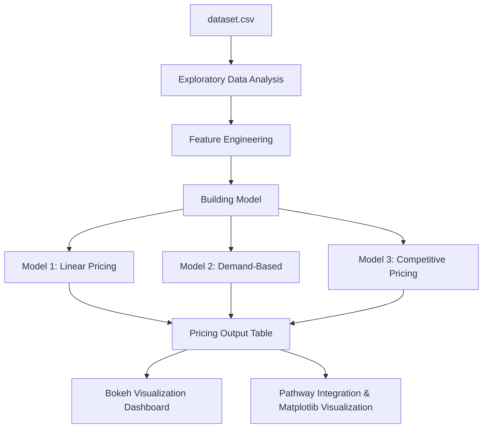

# Capstone-Project-2025
### Capstone Project by Summer Analytics 2025 ( IIT Guwahati )

## Dynamic Pricing for Urban Parking Lots

This repository contains the complete solution to the Summer Analytics 2025 Capstone Project hosted by IIT Guwahati and the Consulting & Analytics Club. The goal is to develop a real-time, intelligent pricing system for 14 urban parking spaces based on occupancy, queue length, traffic congestion, vehicle type, and nearby competition.

---

## 📚 Tech Stack Used

* **Python 3.11**
* **Pandas & NumPy** – data handling and preprocessing
* **Scikit-learn** - for data scaling
* **Bokeh** – real-time visualizations
* **GeoPy** – location-based pricing logic
* **Pathway** – real-time data streaming & processing
* **Google Colab** – development & execution environment

---

## 📊 Architecture Diagram



---

## 🔄 Project Workflow

1. **Data Ingestion**: Dataset streamed into memory using Pathway preserving timestamps.
2. **Exploratory Data Analysis** For obtaining hidden details about the data.
3. **Feature Engineering**: Occupancy rate, queue normalization, vehicle weight encoding.
4. **Model 1**: Increases price linearly based on current occupancy.
5. **Model 2**: Calculates a demand score using five features. Price scaled with smooth bounds.
6. **Model 3**: Adds geo-intelligence. Checks proximity and adjusts pricing competitively.
7. **Real-Time Output**: Streamed results pushed to JSON/log.
8. **Visualization**: Bokeh used to plot pricing across models.

---

## 📂 Repository Contents

```
├── Capstone_Project_Implementation.ipynb.ipynb   # Complete Colab notebook with all models & visualizations
├── Summer_Analytics_Report.pdf          # Final well-documented project report (optional but added)
├── dataset.csv                        # Input data for all models
```

---

## 📄 Optional Report

A detailed PDF report is included in this repository describing:

* Objective & data used
* Model architecture
* Assumptions & pricing functions
* Real-time streaming setup with Pathway

---

