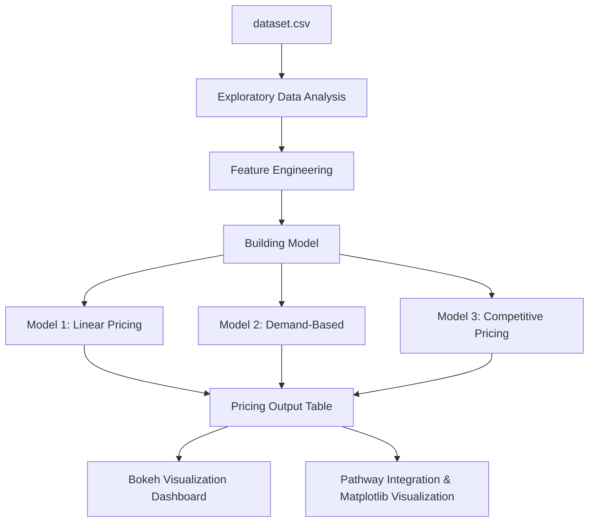

# Capstone-Project-2025
### Capstone Project by Summer Analytics 2025 ( IIT Guwahati )

## Dynamic Pricing for Urban Parking Lots

This repository contains the complete solution to the Summer Analytics 2025 Capstone Project hosted by IIT Guwahati and the Consulting & Analytics Club. The goal is to develop a real-time, intelligent pricing system for 14 urban parking spaces based on occupancy, queue length, traffic congestion, vehicle type, and nearby competition.

---

## 📚 Tech Stack Used

* **Python 3.11**
* **Pandas & NumPy** – data handling and preprocessing
* **Scikit-learn** - for data scaling
* **Bokeh** – real-time visualizations
* **GeoPy** – location-based pricing logic
* **Pathway** – real-time data streaming & processing
* **Google Colab** – development & execution environment

---

## 📊 Architecture Diagram



---

## 🔄 Project Workflow

1. **Understanding the Problem**: Explaining what the project is all about.
2. **Exploratory Data Analysis** For obtaining hidden details about the data.
3. **Feature Engineering**: Occupancy rate, queue normalization, vehicle weight encoding.
4. **Model 1**: Increases price linearly based on current occupancy.
5. **Model 2**: Calculates a demand score using five features. Price scaled with smooth bounds.
6. **Model 3**: Adds geo-intelligence. Checks proximity and adjusts pricing competitively.
7. **Real-Time Output**: Streamed results pushed to JSON.
8. **Visualization**: Bokeh used to plot pricing across models.

---

## Elaborate Workflow Explaination

1. **Understanding the Problem**
    - Getting what is to be done in the project by studying the document given on https://drive.google.com/drive/folders/1ts6zhcX8hAj1X-c9HLre_giZpGT7zxT5
      
2. **Exploratory Data Analysis**
    - Basic insights using .describe(), .dtypes, .duplicated and .isnull() for their features
    - Used headmaps for data correlation
    - Used pd.crosstab for gaining insights that how queue length varies with special day
    - Checked the probabilty distribution profile of Occupancy feature
    - Identifying the hour of the day when occupancy is highest using sns.lineplot

3. **Feature Engineering**
   -  Creating a new feature named occupancy rate. Occupancy rate is calculated as the ratio of the number of occupied spaces to the total capacity of the parking lot.
   -  Mapping categorical values to numerical values for TrafficConditionNearby. This is necessary for machine learning models that require numerical input
   -  Since the categorical columns we required ie VehicleType and TrafficConditionNearby were Ordinal Categorical Variables, we directed mapped them using custom created functions (Ordinal Encoder of scikit-learn library can also be used)
   -  The columns TrafficConditionNearby, QueueLength, occupancy_rate & vehicle_weight were normalised using MinMaxSclaer class from scikit-learn library.
   -  Created a function to visualize the distribution of a feature before and after normalization
  
4. **MODEL BUILDING**
    - Model 1: Baseline Linear Model
          - This model predicts the price based on a linear relationship with occupancy rate.
          - The next price is a function of the previous price and the occupancy ratio, adjusted by a small alpha value.
          - Price(t+1) = Price(t) + α * (Occupancy_rate)
    - Model 2 – Demand-Based Pricing
          - In this model we construct a demand function that takes into account various factors such as occupancy rate, queue length, traffic condition, special days, and vehicle weight.
          - The demand function is a linear combination of these factors, and the price is determined based on the demand normalized to a range of [0,1].
          - The base price is adjusted by a lambda parameter that scales the normalized demand to determine the final price.
          - The parameters are decided by the HEATMAP generated in EDA
    - Model 3 – Competitive Pricing ( NOT FUNCTIONAL )
          - This model aimed to adjust parking prices based on competition from nearby lots.
          - It used geo-coordinates to calculate the average price of lots within a 1 km radius and applied an adjustment factor.

5. **Visualization with Bokeh**
       - Created line plots based on Model 1 and Model 2 for analysing the price predicted by both the models

6. **Pathway Real-Time Data Visualization**
       - Created a pathway stream for visualizating the data in real time.

---

## 📂 Repository Contents

```
├── Capstone_Project_Implementation.ipynb.ipynb   # Complete Colab notebook with all models & visualizations
├── Summer Analytics 2025 – Final Project Report.pdf          # Final well-documented project report (optional but added)
├── dataset.csv                        # Input data for all models
```

---

## 📄 Optional Report

A detailed PDF report is included in this repository describing:

* Objective & data used
* Model architecture
* Assumptions & pricing functions
* Real-time streaming setup with Pathway

---


