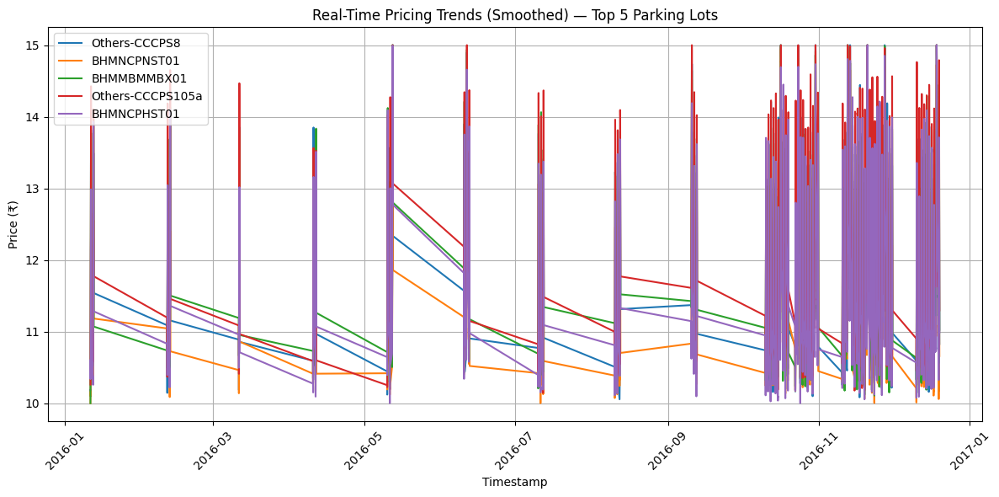

# Capstone-Project-2025
### Capstone Project by Summer Analytics 2025 ( IIT Guwahati )
### The project notebook is fully completed, thoroughly commented, and provides detailed explanations for each step. Do check it out !!!

## Dynamic Pricing for Urban Parking Lots

This repository contains the complete solution to the Summer Analytics 2025 Capstone Project hosted by IIT Guwahati and the Consulting & Analytics Club. The goal is to develop a real-time, intelligent pricing system for 14 urban parking spaces based on occupancy, queue length, traffic congestion, vehicle type, and nearby competition.

---

## 📚 Tech Stack Used

* **Python 3.11**
* **Pandas & NumPy** – data handling and preprocessing
* **Scikit-learn** - for data scaling
* **Bokeh** – real-time visualizations
* **GeoPy** – location-based pricing logic
* **Pathway** – real-time data streaming & processing
* **Google Colab** – development & execution environment

---

## 📊 Architecture Diagram


---

## 🔄 Project Workflow

1. **Understanding the Problem**: Explaining what the project is all about.
2. **Exploratory Data Analysis** For obtaining hidden details about the data.
3. **Feature Engineering**: Occupancy rate, queue normalization, vehicle weight encoding.
4. **Model 1**: Increases price linearly based on current occupancy.
5. **Model 2**: Calculates a demand score using five features. Price scaled with smooth bounds.
6. **Model 3**: Adds geo-intelligence. Checks proximity and adjusts pricing competitively.
7. **Real-Time Output**: Streamed results pushed to JSON.
8. **Visualization**: Bokeh used to plot pricing across models.

---

## 📊 Visualizations from Exploratory Data Analysis

<table>
  <tr>
    <td></td>
    <td></td>
    <td></td>
  </tr>
  <tr>
    <td></td>
    <td></td>
    <td></td>
  </tr>
</table>


<div style="margin-left: 5%;">
  
</div>


---

## ⚙️ Elaborate Workflow Explanation

### 1. Understanding the Problem
- Reviewed the project scope and requirements by studying the documents provided at [this Drive link](https://drive.google.com/drive/folders/1ts6zhcX8hAj1X-c9HLre_giZpGT7zxT5).

### 2. Exploratory Data Analysis (EDA)
- Explored the dataset using methods like `.describe()`, `.dtypes`, `.duplicated()`, and `.isnull()` to understand feature types and data cleanliness.
- Used **heatmaps** to analyze feature correlations.
- Applied `pd.crosstab` to explore how **queue length** varies with **special days**.
- Analyzed the **probability distribution** of the `Occupancy` feature.
- Identified peak occupancy hours using `sns.lineplot`.

### 3. Feature Engineering
- Created a new feature: **Occupancy Rate** = *Occupied Spaces / Total Capacity*.
- Mapped **categorical values** in `TrafficConditionNearby` to numerical ones to make the data model-friendly.
- For **ordinal categorical features** (`VehicleType`, `TrafficConditionNearby`), used custom mapping functions (alternatively, `OrdinalEncoder` from scikit-learn can be used).
- Normalized key features (`TrafficConditionNearby`, `QueueLength`, `occupancy_rate`, `vehicle_weight`) using `MinMaxScaler` from scikit-learn.
- Developed a custom visualization function to show feature distributions **before and after normalization**.

### 4. Model Building

#### Model 1: Baseline Linear Model
- Predicts price based on a **linear relationship** with occupancy rate.
- Formula: `Price(t+1) = Price(t) + α * (Occupancy_rate)`.
- Serves as a baseline benchmark.

#### Model 2: Demand-Based Pricing
- Constructs a **demand function** using occupancy rate, queue length, traffic conditions, special days, and vehicle weight.
- Demand is normalized to [0, 1], and price is calculated by scaling this with a `λ` (lambda) factor.
- Feature importance and parameter weights were informed by **EDA heatmaps**.
```math
\text{demand} = \alpha \cdot \text{occupancy\_rate}_{\text{norm}} + 
                \beta \cdot \text{QueueLength}_{\text{norm}} - 
                \gamma \cdot \text{TrafficConditionNearby}_{\text{norm}} + 
                \delta \cdot \text{IsSpecialDay} + 
                \epsilon \cdot \text{vehicle\_weight}
```
    

#### Model 3: Competitive Pricing *(Not Functional)*
- Intended to adjust pricing based on nearby parking lots using **geo-coordinates**.
- Concept: Calculate average price within a 1 km radius and apply a **competition-based adjustment**.
- Implementation incomplete due to lack of reliable geo-data.

### 5. Visualization with Bokeh
- Developed **interactive line plots** using **Bokeh** to compare price predictions from **Model 1 and Model 2**.

### 6. Pathway Real-Time Data Visualization
- Implemented a **Pathway data stream** for **real-time visualization** and simulation of dynamic parking data.


---

## 📂 Repository Contents

```
├── Capstone_Project_Implementation.ipynb.ipynb   # Complete Colab notebook with all models & visualizations
├── Summer Analytics 2025 – Final Project Report.pdf          # Final well-documented project report (optional but added)
├── dataset.csv                        # Input data for all models
```

---

## 📄 Optional Report

A detailed PDF report is included in this repository describing:

* Objective & data used
* Model architecture
* Assumptions & pricing functions
* Real-time streaming setup with Pathway

---


